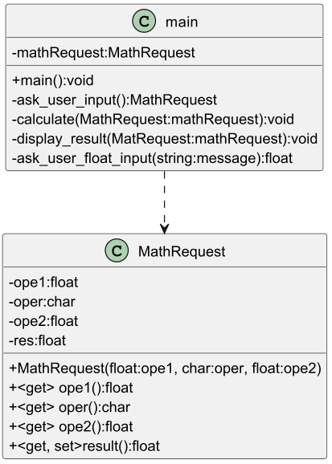

# Calculator

Ce dépôt a été créé à des fins pédagogiques. Il permet de s'entraîner à l'utilisation de git-flow tout comme à s'initier à la programmation orientée objet.

## Comment débuter le travail

Il s'agit de la suite de la première évaluation. Comme vous le verrez à la tâche "03", vous pourrez soit choisir de continuer sur votre code, soit reprendre ce dépôt.

## Backlog
### Tâche 01 - Identifier les futurs objets

Prenez le temps de bien comprendre l'exemple de code livré dans la théorie (vehicle and driver) et tentez d'identifier les objets dont nous aurions besoin pour modéliser correctement la calculatrice.

* [Lien avec le gitbook](https://cpnv-cfc.gitbook.io/i319-concevoir-et-implementer-des-applications/semaines-4-8/theorie-et-concepts/introduction-a-la-poo)

### Tâche 02 - Dessiner le diagramme de classe

Voir le commit présentant la différence d'architecture avant et après le MathRequest.

* [Comparaison avant et après le MathRequest](https://github.com/CPNV-CFC-I319/Eval1-Calculator/commit/eb5c798fe5ca40c2fb7b278e83a99f71fb0c07ea)

Etat de l'architecture pour l'implémentation d'une classe "MathRequest"



## Tâche 03 - Récupérer/Préparer votre projet

Avant de partir la "tête la première", il est important d'avoir une bonne stratégie de branche et d'enrichir petit à petit votre code.
Vous pouvez soit partir du code actuel, soit partir de ce dépôt:

* Soit vous décider de "re-forker-cloner" ce dépôt, et initaliser git-flow.
* Soit vous pouvez continuer sur votre code. Prenez bien soin de détecter les éventuelles différences que vous avez avec cette version du projet.

Comme vous pouvez le voir, la modification de l'architecture (le diagramme de classe) a été réalisée sur la branche _develop_. Il est important d'être sur cette branche avant de continuer le travail.

## Tâche 04 - Créer la branche "feature/MathRequest"

Il s'agit maintenant d'implémenter cette modification sur la branche du nom de "feature/MathRequest".

* [Documentation de référence pour gitflow](https://cpnv-cfc.gitbook.io/i319-concevoir-et-implementer-des-applications/semaines-4-8/theorie-et-concepts/git-flow)

```
   git flow feature start MathRequest
```

Regardez l'architecture imposée et tentez de réussir à faire fonctionner votre calculatrice, avec l'implémentation de MathRequest.

1) débutez par écrire la classe de test
2) adapter l'architecture de votre projet pour pouvoir "run" les tests
3) "failed" les tests
4) coder le comportement de la classe ciblée par les tests
5) faire passer les tests
6) refactoriser si besoin
